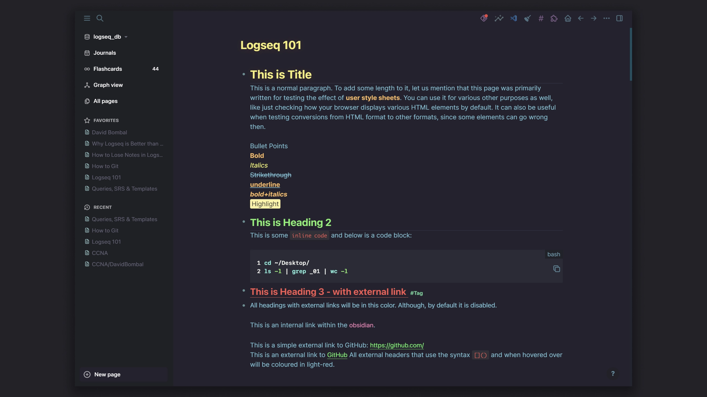
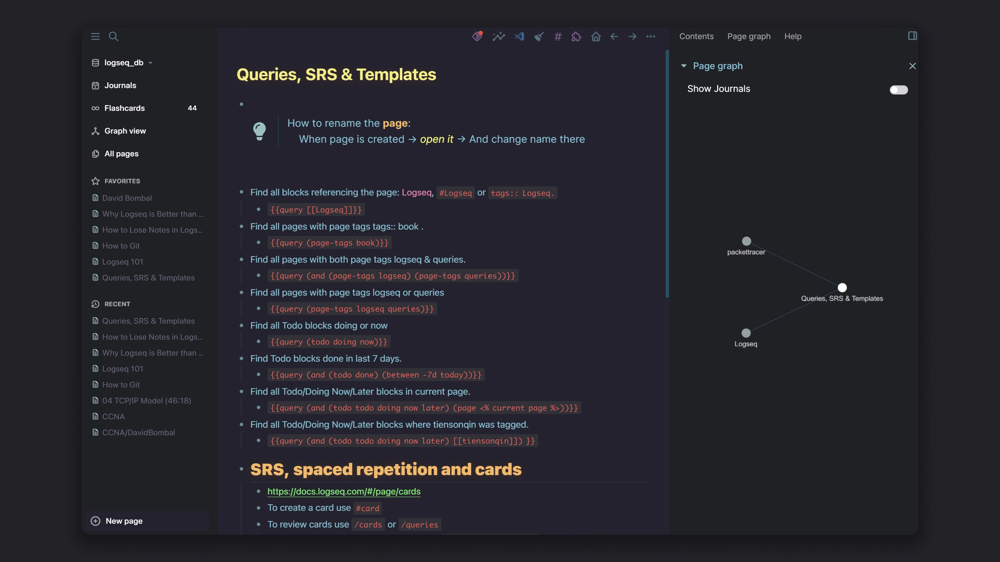
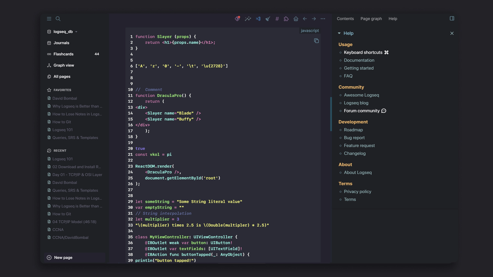

<h1 align="center">
  
   <i style="background-color:#24222e; color:#85bccf;">Arcane</i> 
</h1>

<i>Step into the darkness</i>

1. Distinctive color for: p, <b>b</b> and <i>i</i>  

2. Inline code which stands out  

3. Shiny Syntax x Code Highlighting

## To install Manually

a) **Enable Developer Mode**. Download Theme to your desktop -> Open Logseq App -> Settings -> Advanced -> Toggle "Developer mode" to turn it on -> Settings -> Plugins -> Load unpacked plugin -> manually open folder where the Theme is located.

b) Copy all the CSS code from inside of `Arcane.css` file into /<yourDBname>/.logseq/custom.css -> Reload Logseq